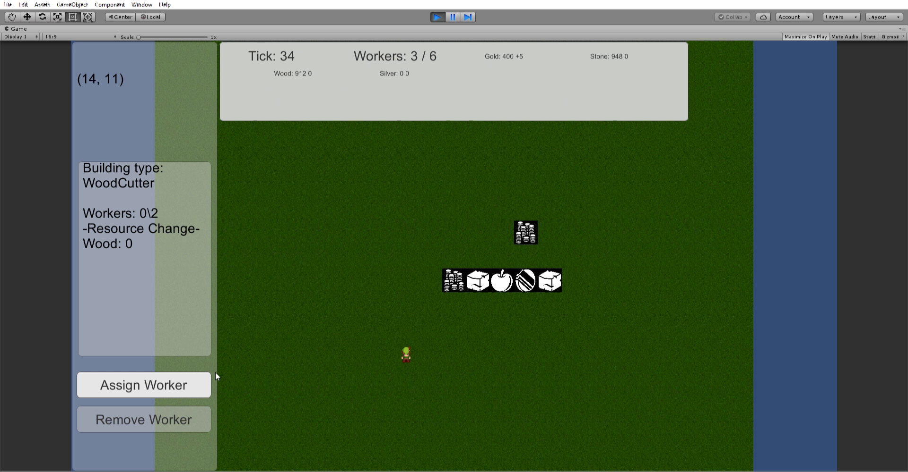

# Resource and Colony Management AI

This project was built in collaboration with [Arthur Bacon](https://github.com/toon-leader-bacon/) as the Capstone project for Game AI course, NEU

This is a simple resource and colony management game. The main goal of the game is to design an A* artificial intelligence that can interact with this game and thrive. Games like this don't often define a "win" condition (games like Cities Skylines, RimWorld, Dwarf Fortress) but do define a lose condition. 

Please see "TestResults.pdf" for a breif overview about the strengths of the different A* algorithism as currently designed. 
